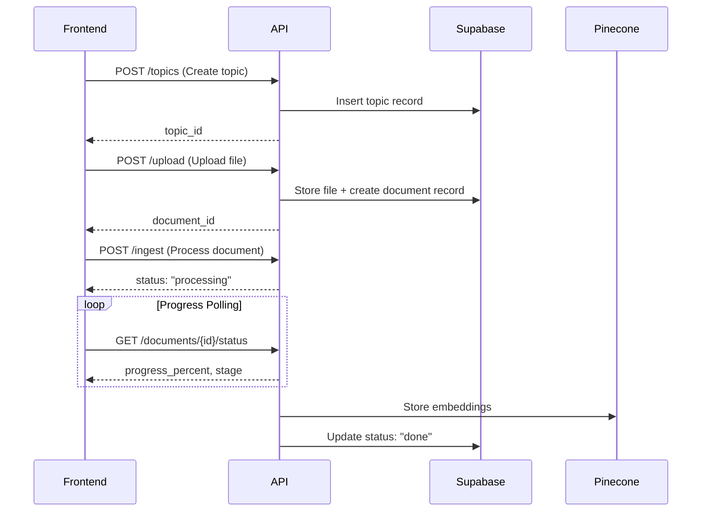

# RAG Ingestion Pipeline - API Documentation

> **Base URL**: Your HuggingFace Spaces deployment URL (e.g., `https://your-space.hf.space`)

---

## Table of Contents

1. [Overview](#overview)
2. [Authentication & Configuration](#authentication--configuration)
3. [API Reference](#api-reference)
   - [Health Check](#health-check)
   - [Topics API](#topics-api)
   - [Upload API](#upload-api)
   - [Ingest API](#ingest-api)
   - [Documents API](#documents-api)
   - [Document Status API](#document-status-api)
4. [Workflow Guides](#workflow-guides)
   - [Dashboard Workflow](#dashboard-workflow---topic-management)
   - [Chat Screen Workflow](#chat-screen-workflow---document-ingestion)
5. [Complete Integration Example](#complete-integration-example)
6. [Error Handling](#error-handling)

---

## Overview

This API enables document ingestion into a RAG (Retrieval-Augmented Generation) pipeline with the following capabilities:

| Feature | Description |
|---------|-------------|
| **Multi-format Support** | PDF, DOCX, PPTX, DOC, PPT, ODT, TXT, RTF |
| **Topic Organization** | Group documents by topics for focused retrieval |
| **Visual Processing** | GPT-4o Vision summarizes images and figures |
| **Progress Tracking** | Real-time status updates during ingestion |
| **User Isolation** | Separate vector namespaces per user |

### Architecture Flow



---

## Authentication & Configuration

### Required Headers

```javascript
const headers = {
  'Content-Type': 'application/json',
  // Note: For file uploads, use 'multipart/form-data'
};
```

### Environment Variables (Frontend)

```javascript
const API_BASE_URL = process.env.REACT_APP_API_URL || 'https://your-space.hf.space';
```

---

## API Reference

### Health Check

Verify the API is running and healthy.

| Method | Endpoint | Description |
|--------|----------|-------------|
| `GET` | `/health` | Returns service health status |

#### Request

```javascript
const response = await fetch(`${API_BASE_URL}/health`);
const data = await response.json();
```

#### Response

```json
{
  "status": "healthy"
}
```

---

### Topics API

Manage topics (collections) for organizing documents.

#### 1. Create Topic

| Method | Endpoint | Description |
|--------|----------|-------------|
| `POST` | `/topics` | Create a new topic for a user |

##### Request Body

| Field | Type | Required | Description |
|-------|------|----------|-------------|
| `user_id` | string | ✅ | Unique user identifier |
| `name` | string | ✅ | Topic name |
| `description` | string | ❌ | Optional topic description |

##### Code Example

```javascript
async function createTopic(userId, name, description = null) {
  const response = await fetch(`${API_BASE_URL}/topics`, {
    method: 'POST',
    headers: { 'Content-Type': 'application/json' },
    body: JSON.stringify({
      user_id: userId,
      name: name,
      description: description
    })
  });
  
  if (!response.ok) {
    throw new Error(`Failed to create topic: ${response.status}`);
  }
  
  return await response.json();
}

// Usage
const topic = await createTopic('user_123', 'Machine Learning Notes', 'Course materials for ML');
console.log(`Created topic: ${topic.id}`);
```

##### Response

```json
{
  "id": "550e8400-e29b-41d4-a716-446655440000",
  "user_id": "user_123",
  "name": "Machine Learning Notes",
  "description": "Course materials for ML"
}
```

---

#### 2. List Topics

| Method | Endpoint | Description |
|--------|----------|-------------|
| `GET` | `/topics/{user_id}` | List all topics for a user |

##### Path Parameters

| Parameter | Type | Description |
|-----------|------|-------------|
| `user_id` | string | User ID to fetch topics for |

##### Code Example

```javascript
async function listTopics(userId) {
  const response = await fetch(`${API_BASE_URL}/topics/${userId}`);
  
  if (!response.ok) {
    throw new Error(`Failed to fetch topics: ${response.status}`);
  }
  
  return await response.json();
}

// Usage
const { topics, count } = await listTopics('user_123');
console.log(`User has ${count} topics`);
```

##### Response

```json
{
  "topics": [
    {
      "id": "550e8400-e29b-41d4-a716-446655440000",
      "user_id": "user_123",
      "name": "Machine Learning Notes",
      "description": "Course materials for ML",
      "created_at": "2025-01-15T10:30:00Z"
    }
  ],
  "count": 1
}
```

---

#### 3. Delete Topic

| Method | Endpoint | Description |
|--------|----------|-------------|
| `DELETE` | `/topics/{topic_id}` | Delete topic and ALL associated data |

> [!CAUTION]
> This operation is **irreversible**. It deletes the topic, all documents within it, and all vector embeddings stored in Pinecone.

##### Path Parameters

| Parameter | Type | Description |
|-----------|------|-------------|
| `topic_id` | string | Topic ID to delete |

##### Code Example

```javascript
async function deleteTopic(topicId) {
  const response = await fetch(`${API_BASE_URL}/topics/${topicId}`, {
    method: 'DELETE'
  });
  
  if (!response.ok) {
    throw new Error(`Failed to delete topic: ${response.status}`);
  }
  
  return await response.json();
}

// Usage with confirmation
async function handleDeleteTopic(topicId, topicName) {
  const confirmed = window.confirm(
    `Are you sure you want to delete "${topicName}"? This will remove all documents and cannot be undone.`
  );
  
  if (confirmed) {
    const result = await deleteTopic(topicId);
    console.log(`Deleted ${result.documents_deleted} documents`);
  }
}
```

##### Response

```json
{
  "status": "deleted",
  "topic_id": "550e8400-e29b-41d4-a716-446655440000",
  "documents_deleted": 5,
  "message": "Topic and all associated data deleted"
}
```

---

### Upload API

Upload documents to storage for later processing.

| Method | Endpoint | Description |
|--------|----------|-------------|
| `POST` | `/upload` | Upload a file and create document record |

> [!NOTE]
> Non-PDF files (DOCX, PPTX, etc.) are automatically converted to PDF before storage.

##### Query Parameters

| Parameter | Type | Required | Description |
|-----------|------|----------|-------------|
| `user_id` | string | ✅ | User uploading the file |
| `topic_id` | string | ✅ | Topic to associate document with |

##### Form Data

| Field | Type | Required | Description |
|-------|------|----------|-------------|
| `file` | File | ✅ | The file to upload |

##### Supported File Types

| Extension | Format |
|-----------|--------|
| `.pdf` | PDF |
| `.docx` | Word Document |
| `.doc` | Word Document (Legacy) |
| `.pptx` | PowerPoint |
| `.ppt` | PowerPoint (Legacy) |
| `.odt` | OpenDocument Text |
| `.txt` | Plain Text |
| `.rtf` | Rich Text Format |

##### Code Example

```javascript
async function uploadDocument(userId, topicId, file) {
  const formData = new FormData();
  formData.append('file', file);
  
  const url = `${API_BASE_URL}/upload?user_id=${userId}&topic_id=${topicId}`;
  
  const response = await fetch(url, {
    method: 'POST',
    body: formData
    // Note: Don't set Content-Type header - browser sets it automatically with boundary
  });
  
  if (!response.ok) {
    const error = await response.json();
    throw new Error(error.detail || 'Upload failed');
  }
  
  return await response.json();
}

// React component example
function FileUploader({ userId, topicId, onUploadComplete }) {
  const [uploading, setUploading] = useState(false);
  
  const handleFileChange = async (e) => {
    const file = e.target.files[0];
    if (!file) return;
    
    setUploading(true);
    try {
      const result = await uploadDocument(userId, topicId, file);
      onUploadComplete(result);
    } catch (error) {
      console.error('Upload failed:', error);
    } finally {
      setUploading(false);
    }
  };
  
  return (
    <input 
      type="file" 
      onChange={handleFileChange} 
      disabled={uploading}
      accept=".pdf,.docx,.doc,.pptx,.ppt,.odt,.txt,.rtf"
    />
  );
}
```

##### Response

```json
{
  "document_id": "660e8400-e29b-41d4-a716-446655440000",
  "file_path": "user_123/topic_456/abc123.pdf",
  "file_name": "lecture_notes.docx",
  "user_id": "user_123",
  "topic_id": "topic_456",
  "status": "pending",
  "message": "File uploaded. Use /ingest to process."
}
```

---

### Ingest API

Trigger background processing of uploaded documents.

| Method | Endpoint | Description |
|--------|----------|-------------|
| `POST` | `/ingest` | Queue documents for ingestion pipeline |

##### Request Body

| Field | Type | Required | Description |
|-------|------|----------|-------------|
| `document_ids` | string[] | ✅ | Array of document IDs to process |

> [!TIP]
> You can process multiple documents in parallel by passing an array of document IDs.

##### Ingestion Pipeline Stages

| Stage | Progress | Description |
|-------|----------|-------------|
| `downloading` | 5% | Fetching file from storage |
| `parsing` | 20% | Extracting text and elements |
| `chunking` | 35-40% | Creating semantic chunks |
| `vision` | 50-70% | Analyzing images with GPT-4o |
| `embedding` | 80% | Generating vector embeddings |
| `storing` | 95% | Uploading to Pinecone |
| `done` | 100% | Processing complete |

##### Code Example

```javascript
async function ingestDocuments(documentIds) {
  const response = await fetch(`${API_BASE_URL}/ingest`, {
    method: 'POST',
    headers: { 'Content-Type': 'application/json' },
    body: JSON.stringify({
      document_ids: documentIds
    })
  });
  
  if (!response.ok) {
    throw new Error(`Ingestion failed: ${response.status}`);
  }
  
  return await response.json();
}

// Single document
const result = await ingestDocuments(['doc_123']);

// Batch processing
const results = await ingestDocuments(['doc_123', 'doc_456', 'doc_789']);
```

##### Response

```json
{
  "status": "processing",
  "queued_count": 3,
  "message": "Processing 3 document(s). Check /documents/{topic_id} for status."
}
```

---

### Documents API

Manage individual documents within topics.

#### 1. List Documents

| Method | Endpoint | Description |
|--------|----------|-------------|
| `GET` | `/documents/{topic_id}` | List all documents in a topic |

##### Path Parameters

| Parameter | Type | Description |
|-----------|------|-------------|
| `topic_id` | string | Topic ID to list documents from |

##### Code Example

```javascript
async function listDocuments(topicId) {
  const response = await fetch(`${API_BASE_URL}/documents/${topicId}`);
  
  if (!response.ok) {
    throw new Error(`Failed to fetch documents: ${response.status}`);
  }
  
  return await response.json();
}

// Usage
const { documents, count } = await listDocuments('topic_456');

// Display documents with status badges
documents.forEach(doc => {
  console.log(`${doc.file_name}: ${doc.status} (${doc.progress_percent}%)`);
});
```

##### Response

```json
{
  "documents": [
    {
      "id": "660e8400-e29b-41d4-a716-446655440000",
      "user_id": "user_123",
      "topic_id": "topic_456",
      "file_name": "lecture_notes.docx",
      "file_path": "user_123/topic_456/abc123.pdf",
      "file_type": "pdf",
      "status": "done",
      "processing_stage": "done",
      "progress_percent": 100,
      "chunk_count": 45,
      "created_at": "2025-01-15T10:30:00Z"
    }
  ],
  "count": 1
}
```

---

#### 2. Delete Document

| Method | Endpoint | Description |
|--------|----------|-------------|
| `DELETE` | `/documents/{document_id}` | Delete a single document |

> [!WARNING]
> This permanently removes the document file, database record, and all vector embeddings from Pinecone.

##### Path Parameters

| Parameter | Type | Description |
|-----------|------|-------------|
| `document_id` | string | Document ID to delete |

##### Code Example

```javascript
async function deleteDocument(documentId) {
  const response = await fetch(`${API_BASE_URL}/documents/${documentId}`, {
    method: 'DELETE'
  });
  
  if (!response.ok) {
    throw new Error(`Failed to delete document: ${response.status}`);
  }
  
  return await response.json();
}

// Usage
const result = await deleteDocument('doc_123');
console.log(result.message); // "Document and vectors deleted"
```

##### Response

```json
{
  "status": "deleted",
  "document_id": "660e8400-e29b-41d4-a716-446655440000",
  "message": "Document and vectors deleted"
}
```

---

### Document Status API

Track real-time processing progress for a specific document.

| Method | Endpoint | Description |
|--------|----------|-------------|
| `GET` | `/documents/{document_id}/status` | Get detailed processing status |

> [!TIP]
> Poll this endpoint every 3-5 seconds while `status` is `"processing"` to show real-time progress updates.

##### Path Parameters

| Parameter | Type | Description |
|-----------|------|-------------|
| `document_id` | string | Document ID to check status |

##### Status Values

| Status | Description |
|--------|-------------|
| `pending` | Uploaded, waiting for ingestion |
| `processing` | Currently being processed |
| `done` | Successfully ingested |
| `failed` | Processing failed |

##### Code Example

```javascript
async function getDocumentStatus(documentId) {
  const response = await fetch(`${API_BASE_URL}/documents/${documentId}/status`);
  
  if (!response.ok) {
    throw new Error(`Failed to get status: ${response.status}`);
  }
  
  return await response.json();
}

// Polling implementation
async function pollDocumentStatus(documentId, onProgress, onComplete, onError) {
  const poll = async () => {
    try {
      const status = await getDocumentStatus(documentId);
      
      onProgress(status);
      
      if (status.status === 'done') {
        onComplete(status);
        return;
      }
      
      if (status.status === 'failed') {
        onError(new Error('Document processing failed'));
        return;
      }
      
      // Continue polling if still processing
      if (status.status === 'processing') {
        setTimeout(poll, 3000); // Poll every 3 seconds
      }
    } catch (error) {
      onError(error);
    }
  };
  
  poll();
}

// React Hook example
function useDocumentStatus(documentId) {
  const [status, setStatus] = useState(null);
  const [isComplete, setIsComplete] = useState(false);
  
  useEffect(() => {
    if (!documentId) return;
    
    pollDocumentStatus(
      documentId,
      (status) => setStatus(status),
      (status) => {
        setStatus(status);
        setIsComplete(true);
      },
      (error) => console.error(error)
    );
  }, [documentId]);
  
  return { status, isComplete };
}
```

##### Response

```json
{
  "document_id": "660e8400-e29b-41d4-a716-446655440000",
  "file_name": "lecture_notes.docx",
  "status": "processing",
  "processing_stage": "vision",
  "progress_percent": 65,
  "stage_details": "Analyzing image 3 of 5",
  "chunk_count": 0,
  "created_at": "2025-01-15T10:30:00Z"
}
```

---

## Workflow Guides

### Dashboard Workflow - Topic Management

The Dashboard screen displays all topics created by the user and allows them to create new topics.

```mermaid
flowchart TD
    A[Dashboard Load] --> B[GET /topics/{user_id}]
    B --> C[Display Topic Cards]
    C --> D{User Action?}
    D -->|Create| E[Show Create Modal]
    E --> F[POST /topics]
    F --> G[Refresh Topic List]
    D -->|Delete| H[Show Confirm Dialog]
    H --> I[DELETE /topics/{topic_id}]
    I --> G
    D -->|Select| J[Navigate to Chat Screen]
```

#### Complete Dashboard Integration

```javascript
// api/topics.js - API client functions
const API_BASE_URL = process.env.REACT_APP_API_URL;

export const topicsApi = {
  list: async (userId) => {
    const res = await fetch(`${API_BASE_URL}/topics/${userId}`);
    if (!res.ok) throw new Error('Failed to fetch topics');
    return res.json();
  },
  
  create: async (userId, name, description) => {
    const res = await fetch(`${API_BASE_URL}/topics`, {
      method: 'POST',
      headers: { 'Content-Type': 'application/json' },
      body: JSON.stringify({ user_id: userId, name, description })
    });
    if (!res.ok) throw new Error('Failed to create topic');
    return res.json();
  },
  
  delete: async (topicId) => {
    const res = await fetch(`${API_BASE_URL}/topics/${topicId}`, {
      method: 'DELETE'
    });
    if (!res.ok) throw new Error('Failed to delete topic');
    return res.json();
  }
};

// components/Dashboard.jsx
import { useState, useEffect } from 'react';
import { topicsApi } from '../api/topics';

export function Dashboard({ userId }) {
  const [topics, setTopics] = useState([]);
  const [loading, setLoading] = useState(true);
  const [showCreateModal, setShowCreateModal] = useState(false);
  
  // Load topics on mount
  useEffect(() => {
    loadTopics();
  }, [userId]);
  
  const loadTopics = async () => {
    setLoading(true);
    try {
      const { topics } = await topicsApi.list(userId);
      setTopics(topics);
    } catch (error) {
      console.error('Failed to load topics:', error);
    } finally {
      setLoading(false);
    }
  };
  
  const handleCreateTopic = async (name, description) => {
    try {
      const newTopic = await topicsApi.create(userId, name, description);
      setTopics([newTopic, ...topics]);
      setShowCreateModal(false);
    } catch (error) {
      console.error('Failed to create topic:', error);
    }
  };
  
  const handleDeleteTopic = async (topicId, topicName) => {
    const confirmed = window.confirm(
      `Delete "${topicName}"? All documents will be permanently removed.`
    );
    
    if (confirmed) {
      try {
        await topicsApi.delete(topicId);
        setTopics(topics.filter(t => t.id !== topicId));
      } catch (error) {
        console.error('Failed to delete topic:', error);
      }
    }
  };
  
  return (
    <div className="dashboard">
      <header>
        <h1>Your Topics</h1>
        <span className="topic-count">{topics.length} topics</span>
        <button onClick={() => setShowCreateModal(true)}>
          + Create Topic
        </button>
      </header>
      
      {loading ? (
        <LoadingSpinner />
      ) : (
        <div className="topic-grid">
          {topics.map(topic => (
            <TopicCard
              key={topic.id}
              topic={topic}
              onSelect={() => navigate(`/chat/${topic.id}`)}
              onDelete={() => handleDeleteTopic(topic.id, topic.name)}
            />
          ))}
        </div>
      )}
      
      {showCreateModal && (
        <CreateTopicModal
          onSubmit={handleCreateTopic}
          onClose={() => setShowCreateModal(false)}
        />
      )}
    </div>
  );
}
```

---

### Chat Screen Workflow - Document Ingestion

The Chat screen shows documents within a topic, allows uploading new documents, and displays real-time ingestion progress.

```mermaid
flowchart TD
    A[Chat Screen Load] --> B[GET /documents/{topic_id}]
    B --> C[Display Document List]
    C --> D{User Action?}
    
    D -->|Upload| E[Select File]
    E --> F[POST /upload]
    F --> G[POST /ingest]
    G --> H[Start Polling]
    H --> I{GET /documents/{id}/status}
    I -->|processing| J[Update Progress UI]
    J --> I
    I -->|done| K[Refresh Document List]
    
    D -->|Delete| L[DELETE /documents/{id}]
    L --> K
```

#### Complete Chat Screen Integration

```javascript
// api/documents.js - API client functions
const API_BASE_URL = process.env.REACT_APP_API_URL;

export const documentsApi = {
  list: async (topicId) => {
    const res = await fetch(`${API_BASE_URL}/documents/${topicId}`);
    if (!res.ok) throw new Error('Failed to fetch documents');
    return res.json();
  },
  
  upload: async (userId, topicId, file) => {
    const formData = new FormData();
    formData.append('file', file);
    
    const res = await fetch(
      `${API_BASE_URL}/upload?user_id=${userId}&topic_id=${topicId}`,
      { method: 'POST', body: formData }
    );
    if (!res.ok) throw new Error('Upload failed');
    return res.json();
  },
  
  ingest: async (documentIds) => {
    const res = await fetch(`${API_BASE_URL}/ingest`, {
      method: 'POST',
      headers: { 'Content-Type': 'application/json' },
      body: JSON.stringify({ document_ids: documentIds })
    });
    if (!res.ok) throw new Error('Ingestion failed');
    return res.json();
  },
  
  getStatus: async (documentId) => {
    const res = await fetch(`${API_BASE_URL}/documents/${documentId}/status`);
    if (!res.ok) throw new Error('Failed to get status');
    return res.json();
  },
  
  delete: async (documentId) => {
    const res = await fetch(`${API_BASE_URL}/documents/${documentId}`, {
      method: 'DELETE'
    });
    if (!res.ok) throw new Error('Failed to delete document');
    return res.json();
  }
};

// hooks/useDocumentUpload.js - Upload and progress hook
import { useState, useRef } from 'react';
import { documentsApi } from '../api/documents';

export function useDocumentUpload(userId, topicId, onComplete) {
  const [uploading, setUploading] = useState(false);
  const [processing, setProcessing] = useState(false);
  const [progress, setProgress] = useState(null);
  const pollingRef = useRef(null);
  
  const upload = async (file) => {
    setUploading(true);
    
    try {
      // Step 1: Upload file
      const uploadResult = await documentsApi.upload(userId, topicId, file);
      setUploading(false);
      setProcessing(true);
      
      // Step 2: Start ingestion
      await documentsApi.ingest([uploadResult.document_id]);
      
      // Step 3: Poll for progress
      startPolling(uploadResult.document_id);
      
    } catch (error) {
      setUploading(false);
      setProcessing(false);
      throw error;
    }
  };
  
  const startPolling = (documentId) => {
    const poll = async () => {
      try {
        const status = await documentsApi.getStatus(documentId);
        setProgress(status);
        
        if (status.status === 'done') {
          setProcessing(false);
          onComplete?.(status);
          return;
        }
        
        if (status.status === 'failed') {
          setProcessing(false);
          throw new Error('Processing failed');
        }
        
        // Continue polling
        pollingRef.current = setTimeout(poll, 3000);
        
      } catch (error) {
        setProcessing(false);
        console.error(error);
      }
    };
    
    poll();
  };
  
  const cancel = () => {
    if (pollingRef.current) {
      clearTimeout(pollingRef.current);
    }
  };
  
  return { upload, uploading, processing, progress, cancel };
}

// components/ChatScreen.jsx
import { useState, useEffect } from 'react';
import { documentsApi } from '../api/documents';
import { useDocumentUpload } from '../hooks/useDocumentUpload';

export function ChatScreen({ userId, topicId }) {
  const [documents, setDocuments] = useState([]);
  const [loading, setLoading] = useState(true);
  
  const { upload, uploading, processing, progress } = useDocumentUpload(
    userId,
    topicId,
    () => loadDocuments() // Refresh on complete
  );
  
  useEffect(() => {
    loadDocuments();
  }, [topicId]);
  
  const loadDocuments = async () => {
    setLoading(true);
    try {
      const { documents, count } = await documentsApi.list(topicId);
      setDocuments(documents);
    } catch (error) {
      console.error('Failed to load documents:', error);
    } finally {
      setLoading(false);
    }
  };
  
  const handleFileSelect = async (e) => {
    const file = e.target.files[0];
    if (file) {
      try {
        await upload(file);
      } catch (error) {
        alert(`Upload failed: ${error.message}`);
      }
    }
  };
  
  const handleDelete = async (documentId) => {
    if (window.confirm('Delete this document?')) {
      try {
        await documentsApi.delete(documentId);
        setDocuments(documents.filter(d => d.id !== documentId));
      } catch (error) {
        alert(`Delete failed: ${error.message}`);
      }
    }
  };
  
  // Count documents by status
  const stats = {
    total: documents.length,
    done: documents.filter(d => d.status === 'done').length,
    processing: documents.filter(d => d.status === 'processing').length
  };
  
  return (
    <div className="chat-screen">
      {/* Stats Header */}
      <div className="stats-bar">
        <span>{stats.total} documents</span>
        <span>{stats.done} ingested</span>
        {stats.processing > 0 && (
          <span className="processing">{stats.processing} processing...</span>
        )}
      </div>
      
      {/* Upload Section */}
      <div className="upload-section">
        <input
          type="file"
          id="file-input"
          onChange={handleFileSelect}
          accept=".pdf,.docx,.doc,.pptx,.ppt,.odt,.txt,.rtf"
          disabled={uploading || processing}
        />
        <label htmlFor="file-input" className="upload-button">
          {uploading ? 'Uploading...' : 'Upload Document'}
        </label>
        
        {/* Progress Indicator */}
        {processing && progress && (
          <div className="progress-card">
            <div className="progress-header">
              <span>{progress.file_name}</span>
              <span>{progress.progress_percent}%</span>
            </div>
            <div className="progress-bar">
              <div 
                className="progress-fill" 
                style={{ width: `${progress.progress_percent}%` }}
              />
            </div>
            <div className="progress-stage">
              {progress.processing_stage}: {progress.stage_details}
            </div>
          </div>
        )}
      </div>
      
      {/* Documents List */}
      <div className="documents-list">
        {documents.map(doc => (
          <DocumentCard
            key={doc.id}
            document={doc}
            onDelete={() => handleDelete(doc.id)}
          />
        ))}
      </div>
    </div>
  );
}

// components/DocumentCard.jsx
function DocumentCard({ document, onDelete }) {
  const statusColors = {
    pending: '#888',
    processing: '#f59e0b',
    done: '#10b981',
    failed: '#ef4444'
  };
  
  return (
    <div className="document-card">
      <div className="document-icon">📄</div>
      
      <div className="document-info">
        <span className="document-name">{document.file_name}</span>
        <span className="document-date">
          {new Date(document.created_at).toLocaleDateString()}
        </span>
      </div>
      
      <div 
        className="status-badge"
        style={{ backgroundColor: statusColors[document.status] }}
      >
        {document.status}
        {document.status === 'done' && ` (${document.chunk_count} chunks)`}
      </div>
      
      {document.status === 'processing' && (
        <div className="mini-progress">
          <div 
            className="mini-progress-fill"
            style={{ width: `${document.progress_percent}%` }}
          />
        </div>
      )}
      
      <button className="delete-button" onClick={onDelete}>
        🗑️
      </button>
    </div>
  );
}
```

---

## Complete Integration Example

Here's a complete API service module that encapsulates all endpoints:

```javascript
// services/ragApi.js
const API_BASE_URL = process.env.REACT_APP_API_URL || 'http://localhost:8000';

class RAGApiService {
  constructor(baseUrl = API_BASE_URL) {
    this.baseUrl = baseUrl;
  }

  // ═══════════════════════════════════════════════════════════════
  // HEALTH
  // ═══════════════════════════════════════════════════════════════
  
  async healthCheck() {
    const res = await fetch(`${this.baseUrl}/health`);
    return res.json();
  }

  // ═══════════════════════════════════════════════════════════════
  // TOPICS
  // ═══════════════════════════════════════════════════════════════
  
  async createTopic(userId, name, description = null) {
    const res = await fetch(`${this.baseUrl}/topics`, {
      method: 'POST',
      headers: { 'Content-Type': 'application/json' },
      body: JSON.stringify({ user_id: userId, name, description })
    });
    
    if (!res.ok) {
      const error = await res.json();
      throw new Error(error.detail || 'Failed to create topic');
    }
    
    return res.json();
  }
  
  async listTopics(userId) {
    const res = await fetch(`${this.baseUrl}/topics/${userId}`);
    
    if (!res.ok) {
      throw new Error('Failed to fetch topics');
    }
    
    return res.json();
  }
  
  async deleteTopic(topicId) {
    const res = await fetch(`${this.baseUrl}/topics/${topicId}`, {
      method: 'DELETE'
    });
    
    if (!res.ok) {
      const error = await res.json();
      throw new Error(error.detail || 'Failed to delete topic');
    }
    
    return res.json();
  }

  // ═══════════════════════════════════════════════════════════════
  // DOCUMENTS
  // ═══════════════════════════════════════════════════════════════
  
  async uploadDocument(userId, topicId, file) {
    const formData = new FormData();
    formData.append('file', file);
    
    const url = `${this.baseUrl}/upload?user_id=${userId}&topic_id=${topicId}`;
    const res = await fetch(url, { method: 'POST', body: formData });
    
    if (!res.ok) {
      const error = await res.json();
      throw new Error(error.detail || 'Upload failed');
    }
    
    return res.json();
  }
  
  async ingestDocuments(documentIds) {
    const res = await fetch(`${this.baseUrl}/ingest`, {
      method: 'POST',
      headers: { 'Content-Type': 'application/json' },
      body: JSON.stringify({ document_ids: documentIds })
    });
    
    if (!res.ok) {
      const error = await res.json();
      throw new Error(error.detail || 'Ingestion failed');
    }
    
    return res.json();
  }
  
  async listDocuments(topicId) {
    const res = await fetch(`${this.baseUrl}/documents/${topicId}`);
    
    if (!res.ok) {
      throw new Error('Failed to fetch documents');
    }
    
    return res.json();
  }
  
  async getDocumentStatus(documentId) {
    const res = await fetch(`${this.baseUrl}/documents/${documentId}/status`);
    
    if (!res.ok) {
      throw new Error('Failed to get document status');
    }
    
    return res.json();
  }
  
  async deleteDocument(documentId) {
    const res = await fetch(`${this.baseUrl}/documents/${documentId}`, {
      method: 'DELETE'
    });
    
    if (!res.ok) {
      const error = await res.json();
      throw new Error(error.detail || 'Failed to delete document');
    }
    
    return res.json();
  }

  // ═══════════════════════════════════════════════════════════════
  // CONVENIENCE: Upload + Ingest with Progress
  // ═══════════════════════════════════════════════════════════════
  
  async uploadAndIngest(userId, topicId, file, onProgress) {
    // Step 1: Upload
    onProgress?.({ stage: 'uploading', percent: 0 });
    const uploadResult = await this.uploadDocument(userId, topicId, file);
    
    // Step 2: Start ingestion
    onProgress?.({ stage: 'queued', percent: 5 });
    await this.ingestDocuments([uploadResult.document_id]);
    
    // Step 3: Poll for progress
    return new Promise((resolve, reject) => {
      const poll = async () => {
        try {
          const status = await this.getDocumentStatus(uploadResult.document_id);
          
          onProgress?.({
            stage: status.processing_stage,
            percent: status.progress_percent,
            details: status.stage_details
          });
          
          if (status.status === 'done') {
            resolve(status);
            return;
          }
          
          if (status.status === 'failed') {
            reject(new Error('Document processing failed'));
            return;
          }
          
          setTimeout(poll, 3000);
        } catch (error) {
          reject(error);
        }
      };
      
      poll();
    });
  }
}

// Export singleton instance
export const ragApi = new RAGApiService();
export default ragApi;
```

---

## Error Handling

### HTTP Status Codes

| Code | Meaning | Action |
|------|---------|--------|
| `200` | Success | Process response data |
| `400` | Bad Request | Check request parameters |
| `404` | Not Found | Resource doesn't exist |
| `500` | Server Error | Retry or contact support |

### Error Response Format

```json
{
  "detail": "Human-readable error message"
}
```

### Error Handling Pattern

```javascript
async function safeApiCall(apiFunction, fallbackMessage) {
  try {
    return await apiFunction();
  } catch (error) {
    // Parse error message from API or use fallback
    const message = error.message || fallbackMessage;
    
    // Log for debugging
    console.error('API Error:', message);
    
    // Show user-friendly notification
    showToast({ type: 'error', message });
    
    throw error; // Re-throw for caller to handle
  }
}

// Usage
const topics = await safeApiCall(
  () => ragApi.listTopics(userId),
  'Failed to load topics'
);
```

---

## Quick Reference Card

| Action | Method | Endpoint | Use Case |
|--------|--------|----------|----------|
| Health check | `GET` | `/health` | Verify API is running |
| Create topic | `POST` | `/topics` | Dashboard: New topic button |
| List topics | `GET` | `/topics/{user_id}` | Dashboard: Load topic cards |
| Delete topic | `DELETE` | `/topics/{topic_id}` | Dashboard: Delete action |
| Upload file | `POST` | `/upload` | Chat: File upload |
| Start ingestion | `POST` | `/ingest` | Chat: After upload |
| List documents | `GET` | `/documents/{topic_id}` | Chat: Document list |
| Document status | `GET` | `/documents/{id}/status` | Chat: Progress polling |
| Delete document | `DELETE` | `/documents/{document_id}` | Chat: Delete action |
